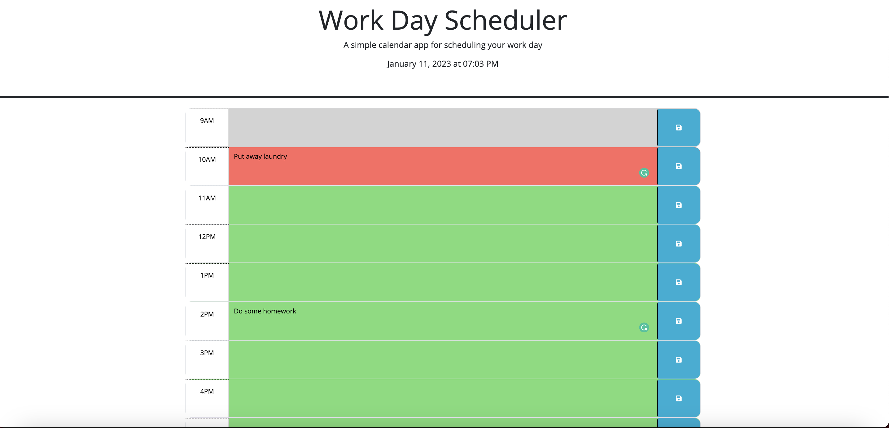
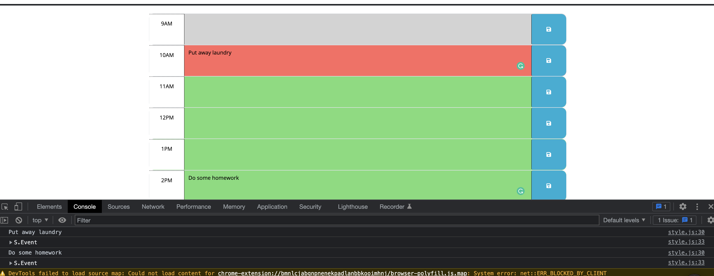

# work-day-scheduler

## Description

This is a simple calender app for scheduling you work day using dayjs and jquery. The time and day is display at the top of the page for the user. The calender consists of time block from 9am-5pm that are color-coded depending on the time of day. These colors represent the past(grey), present(red) and future(green). The user is able to save their input by clicking the save button on the right of the time block. Perfect for scheduling your day to day chores/work.

## Full page view

## Saved in localstorage

## Link    

https://teresarod11.github.io/work-day-scheduler/